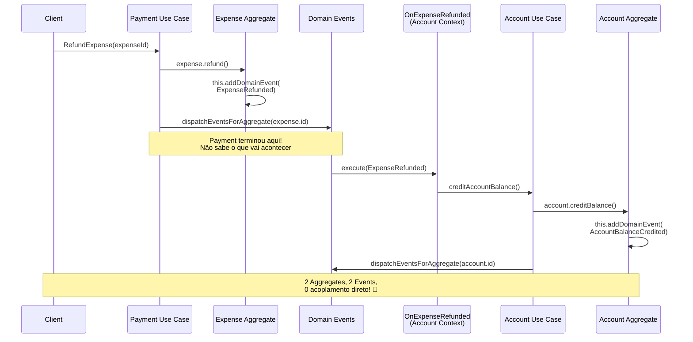
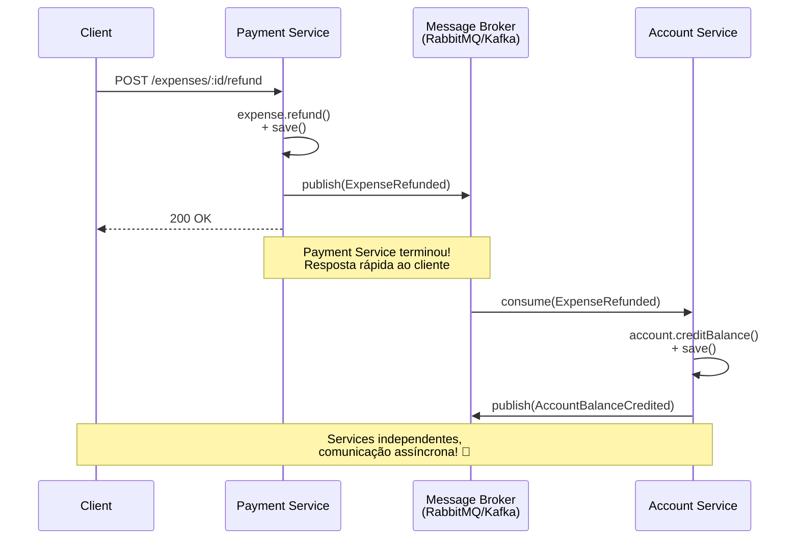

# Domain Events - Explicação Simples

> **Objetivo:** Entender como Domain Events funcionam para permitir comunicação entre Bounded Contexts em um Monólito Modular preparado para extração em Microservices.

---

## O Que São Domain Events? 🎯

Domain Events são **FATOS** que aconteceram no passado dentro do domínio.

**Características:**
- ✅ **Imutáveis**: O que aconteceu, aconteceu
- ✅ **Passado**: `ExpenseRefunded`, `AccountCredited` (nunca `RefundExpense`, `CreditAccount`)
- ✅ **Dados primitivos**: Só informação, sem comportamento
- ✅ **Cross-context**: Podem atravessar bounded contexts

**Não confunda com:**
- ❌ **Commands**: "Faça isso" (presente/futuro)
- ❌ **Queries**: "Me dê isso"
- ❌ **DTOs**: Só transporte de dados

---

## Por Que Usar Domain Events?

### Sem Events (Acoplamento Direto) ❌

```typescript
// ❌ Payment Context conhece Account Context
export class RefundExpenseUseCase {
  constructor(
    private expenseRepo: ExpenseRepository,
    private creditAccount: CreditAccountBalanceUseCase, // ⚠️ Outro contexto!
  ) {}

  async execute(expenseId: string) {
    const expense = await this.expenseRepo.findById(expenseId);
    expense.refund();
    
    // Payment orquestrando Account 🚨
    await this.creditAccount.execute({
      accountId: expense.accountId,
      amount: expense.amount
    });
  }
}
```

**Problemas:**
- 🚨 Payment **depende** de Account
- 🚨 Impossível separar em microservices diferentes
- 🚨 Payment precisa saber O QUE fazer com o estorno (creditar saldo)
- 🚨 Se Account mudar, Payment quebra

### Com Events (Desacoplado) ✅

```typescript
// ✅ Payment Context apenas publica o FATO
export class RefundExpenseUseCase {
  constructor(
    private expenseRepo: ExpenseRepository,
    // Não conhece Account! 🎉
  ) {}

  async execute(expenseId: string) {
    const expense = await this.expenseRepo.findById(expenseId);
    expense.refund(); // Aqui dentro: this.addDomainEvent(new ExpenseRefunded(...))
    
    await this.expenseRepo.save(expense);
    await DomainEvents.dispatchEventsForAggregate(expense.id);
    // Payment não sabe o que vai acontecer! Só diz "aconteceu um estorno"
  }
}

// ✅ Account Context ESCUTA e reage
export class OnExpenseRefunded implements EventHandler {
  constructor(
    private creditAccount: CreditAccountBalanceUseCase, // ✅ Mesmo contexto!
  ) {}

  async execute(event: ExpenseRefunded) {
    await this.creditAccount.execute({
      accountId: event.accountId,
      amount: event.amount.valueInCents
    });
  }
}
```

**Benefícios:**
- ✅ Payment **não conhece** Account
- ✅ Fácil separar em microservices (Payment Service + Account Service)
- ✅ Account decide O QUE fazer quando há estorno
- ✅ Adicionar novos consumidores (Notifications, Audit) sem tocar em Payment

---

## Fluxo Completo: Estorno de Despesa

### Monólito Modular (Atual)



### Microservices (Futuro)



**Mudanças necessárias:**
1. ✅ Estrutura de pastas já está certa (bounded contexts separados)
2. ✅ Events já são primitivos/serializáveis
3. 🔄 Trocar `DomainEvents.dispatch()` por `messagebroker.publish()`
4. 🔄 Subscribers viram Consumers de fila

---

## Onde Cada Coisa Fica

### ❌ ERRADO: Subscriber no contexto que PUBLICA

```
src/modules/
├── payment/
│   ├── domain/
│   │   └── events/
│   │       └── expense-refunded.event.ts ✅ Evento aqui
│   └── application/
│       └── subscribers/
│           └── on-expense-refunded.subscriber.ts ❌ ERRADO!
│                                                  (Payment chama Account)
└── account/
    └── application/
        └── use-cases/
            └── credit-account-balance.use-case.ts
```

**Por que está errado:**
- Payment conhece Account (acoplamento)
- Payment decide o que fazer (não é responsabilidade dele)

### ✅ CORRETO: Subscriber no contexto que REAGE

```
src/modules/
├── payment/
│   ├── domain/
│   │   └── events/
│   │       └── expense-refunded.event.ts ✅ Evento publicado
│   └── application/
│       └── use-cases/
│           └── refund-expense.use-case.ts ✅ Só publica
└── account/
    └── application/
        ├── subscribers/
        │   └── on-expense-refunded.subscriber.ts ✅ CORRETO!
        │                                         (Account reage)
        └── use-cases/
            └── credit-account-balance.use-case.ts ✅ Mesmo contexto
```

**Por que está correto:**
- Payment não conhece Account
- Account decide o que fazer quando ouve o evento
- Fácil extrair: Payment Service publica, Account Service consome

---

## Regras de Ouro 🏆

### 1. Eventos Ficam no Contexto que os PUBLICA
```
✅ payment/domain/events/expense-refunded.event.ts
✅ account/domain/events/account-balance-credited.event.ts
```

### 2. Subscribers Ficam no Contexto que REAGE
```
✅ account/application/subscribers/on-expense-refunded.subscriber.ts
   (Account escuta Payment)

✅ notification/application/subscribers/on-expense-refunded.subscriber.ts
   (Notification também pode escutar!)
```

### 3. Eventos São FATOS, Não Comandos
```
✅ ExpenseRefunded, AccountCredited, MemberAdded
❌ RefundExpense, CreditAccount, AddMember
```

### 4. Eventos Contêm Apenas Dados Primitivos
```typescript
// ✅ CORRETO
export class ExpenseRefunded {
  accountId: string;              // ✅ Primitivo
  amount: MonetarySnapshot;       // ✅ Integration Contract (primitivo)
  refundedAt: Date;              // ✅ Primitivo
}

// ❌ ERRADO
export class ExpenseRefunded {
  account: Account;              // ❌ Aggregate (não serializa)
  amount: Money;                 // ❌ Value Object (não serializa)
}
```

### 5. Um Evento, Vários Consumidores
```
ExpenseRefunded
  ├─> AccountContext: Credita saldo
  ├─> NotificationContext: Envia email
  ├─> AuditContext: Registra auditoria
  └─> AnalyticsContext: Atualiza métricas
```

Payment não sabe de NENHUM deles! 🎉

---

## Checklist de Validação ✅

Quando criar/mover um subscriber, pergunte:

1. **O subscriber está no contexto que REAGE ao evento?**
   - ✅ SIM: `on-expense-refunded` está em `account/` (Account reage)
   - ❌ NÃO: Mover para o contexto correto

2. **O subscriber chama use case do MESMO contexto?**
   - ✅ SIM: Account subscriber → Account use case
   - ❌ NÃO: Você criou acoplamento entre contextos

3. **O contexto que publica o evento sabe do subscriber?**
   - ✅ NÃO: Payment não sabe que Account existe
   - ❌ SIM: Acoplamento direto, remove o subscriber

4. **O evento contém apenas primitivos?**
   - ✅ SIM: `string`, `number`, `Date`, `MonetarySnapshot`
   - ❌ NÃO: Converter para Integration Contract

5. **Posso separar os contextos em microservices só trocando o broker?**
   - ✅ SIM: Arquitetura correta! 🎉
   - ❌ NÃO: Tem acoplamento direto entre contextos

---

## Exemplo Completo: Refatoração

### ❌ Antes (ERRADO)

```typescript
// src/modules/payment/application/subscribers/on-expense-refunded.subscriber.ts
export class OnExpenseRefunded implements EventHandler {
  constructor(
    private readonly creditAccountBalance: CreditAccountBalanceUseCase, // ⚠️ Outro contexto!
  ) {}

  async execute(event: ExpenseRefunded): Promise<void> {
    await this.creditAccountBalance.execute({ ... }); // 🚨 Payment → Account
  }
}
```

**Problemas:**
- Payment depende de Account
- Subscriber no contexto errado
- Impossível separar em microservices

### ✅ Depois (CORRETO)

```typescript
// src/modules/account/application/subscribers/on-expense-refunded.subscriber.ts
export class OnExpenseRefunded implements EventHandler {
  constructor(
    private readonly creditAccountBalance: CreditAccountBalanceUseCase, // ✅ Mesmo contexto!
  ) {}

  async execute(event: ExpenseRefunded): Promise<void> {
    await this.creditAccountBalance.execute({ ... }); // ✅ Account → Account
  }
}
```

**Benefícios:**
- ✅ Payment não conhece Account
- ✅ Subscriber no contexto correto
- ✅ Pronto para microservices

---

## Como Isso Vira Microservices?

### Monólito Modular (Hoje)
```typescript
// In-memory, síncrono
DomainEvents.dispatchEventsForAggregate(expense.id);
```

### Microservices (Amanhã)
```typescript
// Message broker, assíncrono
await messageBroker.publish('expense.refunded', event);
```

**O que muda:**
1. `DomainEvents` → Message Broker (RabbitMQ, Kafka, SQS)
2. `EventHandler.execute()` → Consumer/Handler assíncrono
3. Mesma estrutura de pastas
4. Mesmo design de eventos
5. **Zero mudanças nos Aggregates!** 🎉

---

## Padrões Comuns

### 1. Reação em Cadeia
```
ExpenseRefunded
  └─> AccountBalanceCredited
      └─> NotificationSent
```

### 2. Saga/Process Manager
```
PaymentInitiated
  ├─> ReserveBalance
  ├─> ValidateExpense
  └─> ConfirmPayment (se tudo OK)
      ou CancelPayment (se erro)
```

### 3. Event Sourcing (Avançado)
```
Aggregate = reduce(eventos)
Account balance = sum(todas as transações)
```

---

## Armadilhas Comuns 🚨

### ❌ 1. Subscriber no Contexto Errado
```typescript
// payment/subscribers/on-expense-refunded.ts ❌
// Deveria estar em account/subscribers/ ✅
```

### ❌ 2. Usar Eventos como RPC
```typescript
// ❌ ERRADO: Esperar resposta de evento
const result = await dispatchEvent(new ExpenseRefunded(...));
if (result.success) { ... }

// ✅ CORRETO: Fire and forget
await dispatchEventsForAggregate(expense.id);
```

### ❌ 3. Eventos com Domain Objects
```typescript
// ❌ ERRADO
new ExpenseRefunded({ amount: Money.create(100) })

// ✅ CORRETO
new ExpenseRefunded({ amount: toMonetarySnapshot(money) })
```

### ❌ 4. Eventos como Commands
```typescript
// ❌ ERRADO: Comando disfarçado
new RefundExpense({ expenseId: '123' })

// ✅ CORRETO: Fato passado
new ExpenseRefunded({ expenseId: '123', refundedAt: new Date() })
```

---

## Próximos Passos

1. ✅ Entender conceito de Domain Events
2. 🔄 Refatorar subscribers para os contextos corretos
3. ⏭️ Implementar todos os eventos mapeados em `domain-events-implementation.md`
4. ⏭️ Adicionar testes de integração para eventos
5. ⏭️ Preparar camada de Message Broker para extração

---

## Referências

- **Domain-Driven Design** (Vernon, 2013) - Chapter 8: Domain Events
- **Implementing Domain-Driven Design** (Vernon, 2013)
- **Microsoft .NET Microservices Architecture**
- **Martin Fowler**: Event-Driven Architecture
- **Fintech Reference**: Nubank Engineering Blog, Stone Tech Blog

---

**TL;DR:**
- Domain Events = FATOS do passado
- Subscriber fica no contexto que REAGE, não no que publica
- Payment publica → Account escuta → Zero acoplamento
- Pronto para virar microservices! 🚀
